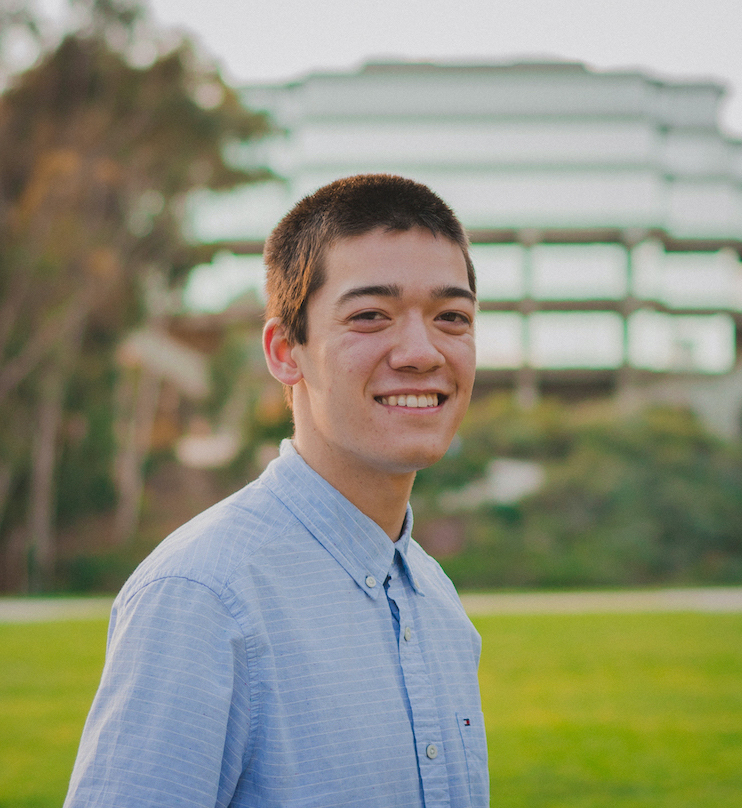

# Sections
- [Sections](#sections)
- [About Me](#about-me)
- [Hobbies](#hobbies)
- [Background in Computer Science](#background-in-computer-science)
    - [Teaching/Tutoring](#teachingtutoring)
- [More Info](#more-info)

# About Me

`print(Hello World!)` My name is Ethan Wadsworth, and I am a current second-year computer sciecne major at the University of California, San Diego (UCSD). I am from Downey, CA, but am actually currently living on campus here at UCSD in Warren. I also have a twin brother named Derek who also goes to UCSD.

I am more of a cat person (but I have nothing against dogs).

I mean, how can this not cheer you up?

# Hobbies 

My hobbies include:
- **Swimming** (swam competitively for 7 years)
- **Video games and esports** (Dota 2, League of Legends, Smash, Overwatch)
- **Learning languages** (currently learning Japaneses)
- **Anime** (currently watching Dota: Dragon's Blood)
- **Traveling** (see my bucket list)

When it comes to traveling, here is the current status of my travel bucket list:
- [x] Hawaii
- [x] New York
- [x] Bermuda
- [x] Spain
- [x] Canada
- [ ] Japan
- [ ] South Korea
- [ ] China 

# Background in Computer Science

The languages and technologies that I am familiar with include HTML/CSS, Node, Javascript, React, C, C++, Java, and Python. My favorite programming language has to be Python because it can be used for practically anything that suits your needs. From machine learning to data analysis to server programming, Python seems to have libraries for anything and everything (*even it is slow*). 

Basically any Python programmer when trying to write programs in other languages:
> "I can do that in 10 lines of Python code."

Just another reason why **_I like Python so much_**.

I am the current computer vision technical lead for Triton Robotics, one of the engineering organizations here on campus. We compete in the Robomaster Competition where we are tasked with designing robots armed with turrets to hunt down and destroy the robots on the other team in a first-person shooter-like comptetition. I lead the development of real time object tracking software that functions as an aimbot to provide coordinate data to our turrent to automatically aim and fire at any enemy robots it detects. 

I got into fullstack development this past summer, and really enjoy going to hackathons as well. You can find what I have developed for past hackathons at my [devpost](https://devpost.com/ethan-seiji-wads?ref_content=user-portfolio&ref_feature=portfolio&ref_medium=global-nav).

### Teaching/Tutoring

---

I also really enjoy teaching and being involved with computer science education. I started tutoring for the computer science department here at UCSD last quarter for CSE 8A, and am tutoring for CSE 30 this quarter. I also teach basic image processing and computer vision to new Triton Robotics recruits, and wrote my own resources for this purpose that have step-by-step implementations of many of the algorithms in the opencv library. For anyone interested, these resources can be found [here](https://github.com/EthanWadsworth/TR_CV_Notes).

# More Info
If you want to learn more about me and what I've done, visit my [website](https://ethanwadsworth.github.io/)!

[README to back to submission](README.md)